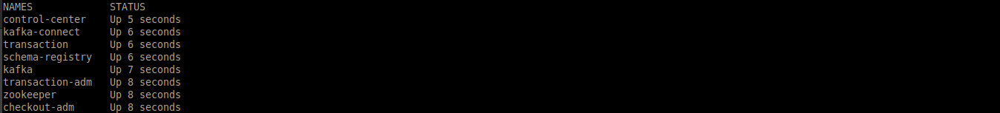
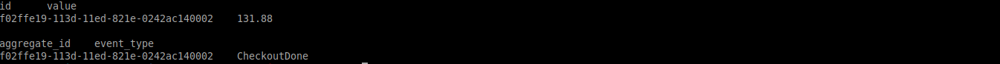
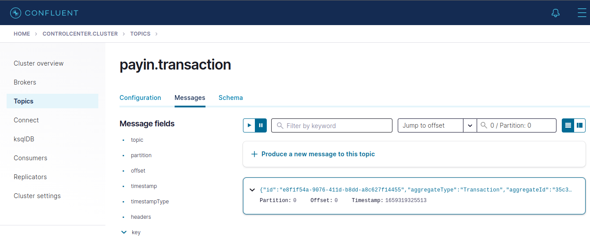

# Transactional outbox

* [Overview](#overview)
* [Instalação](#installation)
    - [Repositório](#repository)
    - [Configuração](#configure)
* [Roadmap](#roadmap)
    - [Verificando o ambiente](#checking)
    - [Executando o caso de uso](#run_use_case)
* [Úteis](#useful)

<!--suppress HtmlDeprecatedAttribute -->

<div id="overview"></div> 

## Overview

Este projeto é uma POC para apresentar na prática uma forma de implementar o
padrão [Transactional outbox](https://microservices.io/patterns/data/transactional-outbox.html). Eu escrevi
este [artigo](https://medium.com/@gustavo.freze/transactional-outbox-ea8294070f28), explicando o que é o padrão, quando e o porque usá-lo.

### Implementação

Existem maneiras distintas de implementar o padrão _Transactional outbox_. E a forma proposta nesta POC, basicamente,
se apoia em 3 passos.

- Salvar de forma transacional o seu registro do modelo e do evento. O código abaixo é a implementação
  do [Adapter](./transaction/src/main/kotlin/driven/transaction/repository/Adapter.kt) do _repository_.

  ```kotlin
  override fun save(event: TransactionRequested): Unit = jdbi.inTransactionUnchecked { handle ->
        handle
            .createUpdate(INSERT)
            .bind("id", event.transactionId.value.toString())
            .bind("value", event.amount.positive.value)
            .bind("currency", event.amount.currency.toString())
            .bind("countryAlpha2", event.country.alpha2)
            .execute()

        outboxEventOf(event = event).also { it.insertUsing(handle = handle) }
  }
  ```

- Definir um [Schema](./transaction/src/main/resources/kafka/schemas) para o evento, neste caso, utilizei o formato
  JSON.

- Definir um [Conector](./transaction/src/main/resources/kafka/connectors) para a tabela de outbox.

<div id='installation'></div> 

## Instalação

<div id='repository'></div> 

### Repositório

Para clonar o repositório usando a linha de comando, execute:

```bash
https://github.com/gustavofreze/transactional-outbox.git
```

<div id='configure'></div> 

### Configuração

Verifique se algum processo usa as portas: **2181**, **3306**, **3307**, **8081**, **8083**, **8084**, **9021**,
**9092** e **29092**. Se alguma das portas descritas estiver em uso, ela deve ser “liberada”.

Para instalar e configurar o projeto, execute na raiz do projeto:

```bash
make configure
```

<div id='roadmap'></div> 

## Roadmap

<div id='checking'></div> 

### Verificando o ambiente

Para executar o caso de uso, basta estar com o ambiente docker inicializado.

Você pode conferir executando na raiz do projeto:

```bash
make configure-status
```

<p align="center">
    
    <br />
    <tl>Containers inicializados.</tl>
</p>

<div id='run_use_case'></div> 

### Executando o caso de uso

O caso de uso, consiste em uma transação solicitada pelo domínio de `Checkout`, por meio do
evento `CheckoutDone`. Quando este evento ocorre, um registro é inserido na tabela do modelo, e outro
na tabela de **outbox**, do domínio de `Checkout`. Com a tabela de **outbox** mapeada para o _Kafka connect_, ele lê os
arquivos de [bin log](https://dev.mysql.com/doc/internals/en/binary-log-overview.html), e então publica os dados no
tópico`payin.checkout`.

  ```bash
  make checkout-done
  ```

<p align="center">
    
    <br />
    <tl>Registros de checkout inseridos.</tl>
</p>

Com os dados publicados no tópico `payin.checkout`, uma política do domínio de `Transaction` reage a este evento,
resultando no comando `RequestTransaction`. A execução do comando, resulta no evento `TransactionRequested`. Quando este
evento ocorre, um registro é inserido na tabela do modelo, e outro
na tabela de **outbox**, do domínio de `Transaction`.
Da mesma forma a qual foi explicado anteriormente, o _Kafka connect_ irá ler os arquivos de
[bin log](https://dev.mysql.com/doc/internals/en/binary-log-overview.html), e então publicar os dados do evento
`TransactionRequested` no tópico `payin.transaction`.

Acessando o [Control Center](http://localhost:9021/clusters), é possível verificar os eventos publicados em seus
respectivos tópicos. No menu **_Topics_**, na aba **_Messages_**, utilize o filtro **_Partition_**, definindo o valor
como **0**.

<p align="center">
    
    <br />
    <tl>Eventos do tópico payin.transaction.</tl>
</p>

<div id="useful"></div> 

## Úteis

- Para todos os containers do projeto:

  ```bash
  make stop
  ```

- Remove todos os containers e networks criados pelo projeto:

  ```bash
  make clean
  ```

- Remove todos os containers, networks e imagens criados pelo projeto:

  ```bash
  make clean-all
  ```
